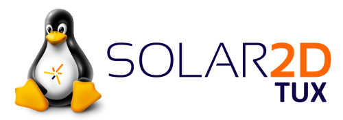

# Solar2DTux Linux App & Game Engine

> Simple to learn and use, completely free and open source 2D game/application engine.



## About:

This is a fork of the Solar2D games & applications SDK for Linux systems. 

## Goals

The goal is to make a fully featured Linux client for the Solar2D engine. We want to bring Linux support up to the standards of the Mac & Windows version of 
Solar2D, to enable Linux developers to build native Linux, Raspberry Pi and Android apps/games all from the platform that they love.

## I'm looking for Windows / Mac versions.

If you're after Windows / Mac versions, I'll direct you to the [original Solar2D repository](https://github.com/Shchvova/corona).

## So, who should I sponsor?

If you're not interested in using Solar2D on Linux, you should sponsor the [original repository](https://github.com/Shchvova/corona). If, however, you are interested in supporting Solar2D on Linux development, you should sponsor this repository via the sponsor button at the top of this page.

## Easy-to-learn & powerful
Solar2D is a cross-platform framework ideal for rapidly creating apps and games for mobile devices, TV, desktop systems and HTML5. That means you can create your project once and publish it to multiple types of devices, including Apple iPhone and iPad, Android phones and tablets, Amazon Fire, Mac Desktop, Windows Desktop, Linux, HTML5 and even connected TVs such as Apple TV, Fire TV, and Android TV.

## Feature highlights

### Solar2D Simulator
Solar2D speeds up the development process. Update your code, save the changes, and instantly see the results in the instant-update Simulator.

### Lua-based
Lua is an open source scripting language designed to be lightweight, fast, yet also powerful. Lua is currently the leading scripting language in games and has been utilized in Roblox, The Elder Scrolls Online, Don't Starve, World of Warcraft ™, Angry Birds ™, Civilization ™, and [many other popular franchises.](https://en.wikipedia.org/wiki/Category:Lua-scripted_video_games)

### Plugins for all needs
Select from numerous plugins which extend the Solar2D core for features like in-app advertising, analytics, media, and much more. A vast variety of plugins is available via [Solar2D free directory](https://plugins.solar2d.com/) or third party stores, like [Solar2D Marketplace](https://solar2dmarketplace.com/).

### Call any native library
If it’s not already in the core or supported via a plugin, you can call any native (C/C++/Obj-C/Java) library or API using Solar2D Native. It also allows to easily package your code as a plugin.

### Cross-platform
Develop for mobile, desktop, and connected TV devices with just one code base. Note that building for certain devices have to be performed on specific operating systems.

On Linux you can build for:

- Linux
- Raspberry Pi
- Android

To build for iOS/Mac, you need to run Solar2D on a Mac and build your project, likewise for Windows.

## Installation
The easiest and recommended way to get started with Solar2D is to download binary distribution from the [releases](https://github.com/DannyGlover/Solar2D/releases) page.

### API documentation and guides
Exhaustive Solar2D API documentation, as well as getting started and more advanced guides are available [here](http://docs.coronalabs.com).

## Source Code and licensing
Solar2D is licensed under [MIT](LICENSE) open source license.

This license gives you the full rights to customize the engine and distribute built apps on your own terms. 
Note that Solar2D incorporates many libraries, both [third-party](sdk/dmg/Corona3rdPartyLicenses.txt) and made by Solar2D developers. They may have different licenses.

## Contributing

If you are willing to improve Solar2D by contributing code, fork this repository and create a pull request with desired improvements. The project uses [git submodules](https://git-scm.com/book/en/Git-Tools-Submodules), so to clone the whole source code tree run

```sh
git clone --recursive git@github.com:DannyGlover/Solar2DTux.git
```

Due to the open source nature of Solar2D distribution, all contributors would have to sign a simple Contributor License Agreement (CLA) to ensure that their code can be part of Solar2D ecosystem. For more details see [CONTRIBUTING.md](CONTRIBUTING.md).

Entry points for each platform are located in the `platform` directory. Refer to README.md files in its subdirectories.
